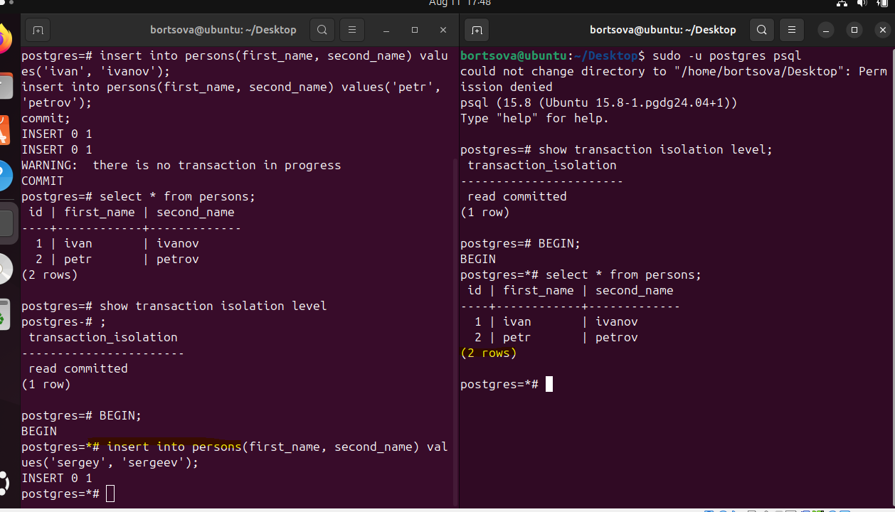

1. Установлена Ubuntu 24.04 LTS на виртуальной машине в VirtualBox и на ней PostgreSQL 15:

        sudo apt update && sudo apt upgrade -y && sudo sh -c 'echo "deb http://apt.postgresql.org/pub/repos/apt $(lsb_release -cs)-pgdg main" > /etc/apt/sources.list.d/pgdg.list' && wget --quiet -O - https://www.postgresql.org/media/keys/ACCC4CF8.asc | sudo apt-key add - && sudo apt-get update && sudo apt-get -y install postgresql-15

   

2. Запущены две сессии под пользователем postgres, выключен autocommit

        sudo -u postgres psql
        \set AUTOCOMMIT OFF
        show transaction isolation level

   

3. Создали таблицу persons, наполнили данными
    

4. Транзакция в сессиях:

       BEGIN;

    Мы отключили AUTOCOMMIT и поэтому эта транзакция считается не зафиксированной, а работаем мы в read committed т.е. показываются все записи, которые уже зафиксированны (commit)
   

5. Завершаем 1-ю транзакцию

       COMMIT;

   Новая запись появилась т.к. мы зафиксировали транзакцию (commit) т.к. работаем мы в read committed т.е. показываются все записи, которые уже зафиксированны (commit)
   Завершаем 2-ю транзакцию

       COMMIT;

  

6. Начинаем новую транзакцию в repeatable read

       BEGIN;
       set transaction isolation level repeatable read;

* В первой сессии добавить новую запись insert into persons(first_name, second_name) values('sveta', 'svetova'); сделать select * from persons во второй сессии. видите ли вы новую запись и если да то почему?
    * Новую запись мы не видим т.к. мы работаем мы в repeatable read. Это говорит о том, что в СУБД создан снимок данных на начало транзакции и мы будем видеть только те данные, которые есть, и не будем видеть новые(зафиксированные) данные.
* Завершить первую транзакцию - commit; сделать select * from persons во второй сессии. видите ли вы новую запись и если да то почему?
    * Новую запись мы не видим т.к. мы работаем мы в repeatable read. Это говорит о том, что в СУБД создан снимок данных на начало транзакции и мы будем видеть только те данные, которые есть, и не будем видеть новые(зафиксированные) данные.
* Завершить вторую транзакцию. сделать select * from persons во второй сессии. видите ли вы новую запись и если да то почему?
   * Мы видим новую запись т.к. после фиксации транзакции мы переходим в уровень изоляции по умолчанию т.е. в read committed
