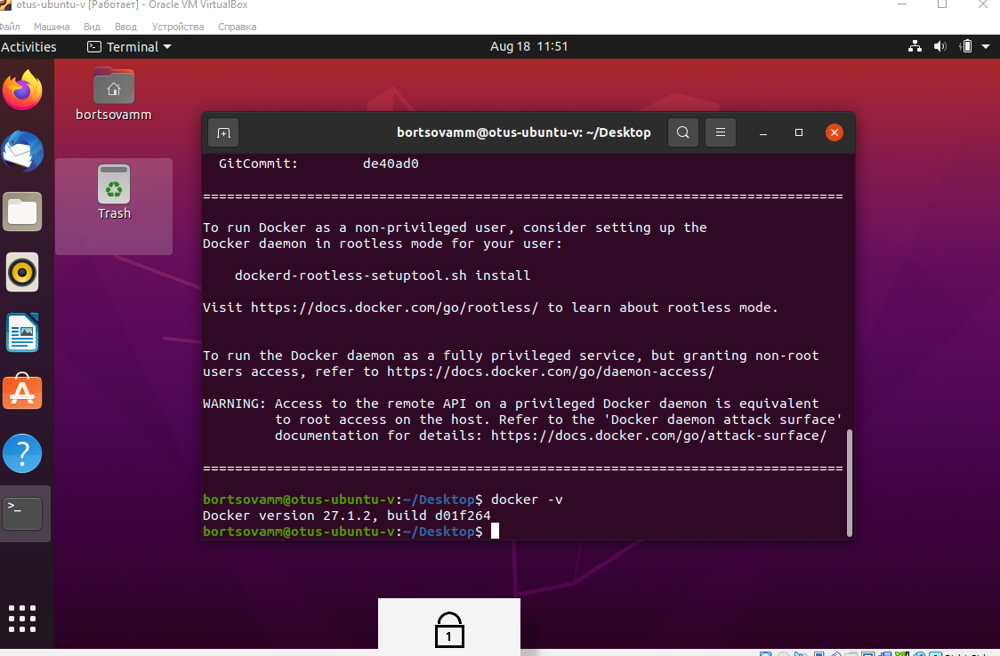
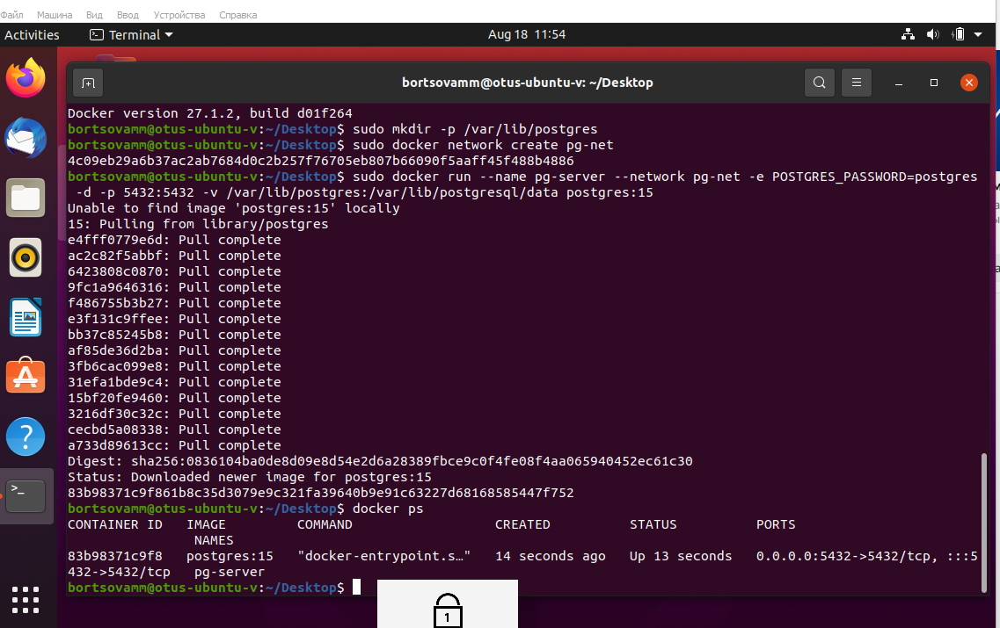
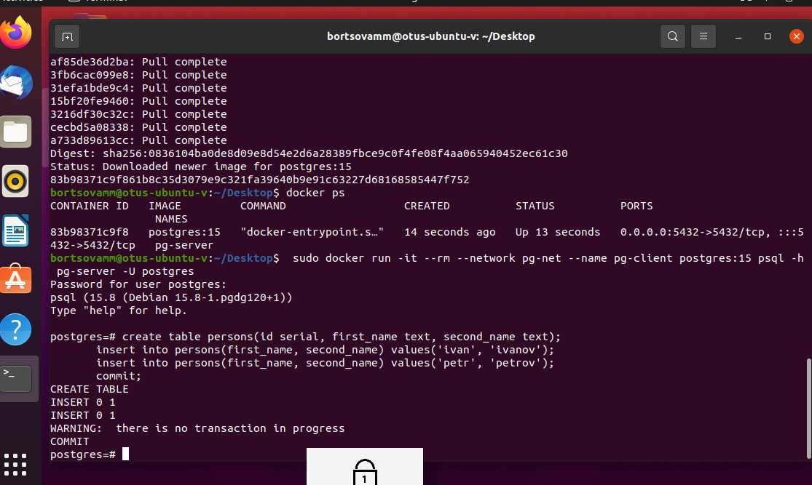

1. Установлена Ubuntu 24.04 LTS на виртуальной машине в VirtualBox и поствлен Docker Engine:

        curl -fsSL https://get.docker.com -o get-docker.sh && sudo sh get-docker.sh && rm get-docker.sh && sudo usermod -aG docker $USER

   

2. Создаем каталог

       sudo mkdir -p /var/lib/postgres

3. Разворачиваем контейнер с PostgreSQL 15

       sudo docker network create pg-net
       sudo docker run --name pg-server --network pg-net -e POSTGRES_PASSWORD=postgres -d -p 5432:5432 -v /var/lib/postgres:/var/lib/postgresql/data postgres:15

    

4. Разворачиваем контейнер с клиентом и запускаем совместно с контейнером с СУБД

       sudo docker run -it --rm --network pg-net --name pg-client postgres:15 psql -h pg-server -U postgres

5. Делаем таблицу с данными

       create table persons(id serial, first_name text, second_name text);
       insert into persons(first_name, second_name) values('ivan', 'ivanov');
       insert into persons(first_name, second_name) values('petr', 'petrov');
       commit;

  

6. Подключаемся к контейнеру с сервером с ноутбука через WSL

          sudo apt update && sudo apt upgrade
          sudo apt install postgresql postgresql-contrib
          psql --version
          sudo service postgresql start

   Подключение к контейнеру с PostgreSQL 15 с ноутбука
   Настроить сеть на VirtualBox на Сетевой мост, узнать ip

          psql -p 5432 -U postgres -h 192.168.0.104 -d postgres -W

   Считаем количество данных в таблицу или выводим ее содержимое

        psql -p 5432 -U postgres -h 192.168.0.104 -d postgres -W -c "select count(*) from persons"
        psql -p 5432 -U postgres -h 192.168.0.104 -d postgres -W -c "select * from persons"

7. Удаляем контейнер с сервером
    Получаем список контейнеров, чтобы получить container id

       sudo docker ps -a

   Удаляем контейнер

       sudo docker rm 6c986aa54227 -f

8. создаем контейнер с PostgreSQL 15 заново

           sudo docker run --name pg-server --network pg-net -e POSTGRES_PASSWORD=postgres -d -p 5432:5432 -v /var/lib/postgres:/var/lib/postgresql/data postgres:15

9. Подключаемся к контейнеру с клиентом и запускаем совместно с контейнером с СУБД

          sudo docker run -it --rm --network pg-net --name pg-client postgres:15 psql -h pg-server -U postgres

10. Проверяем данные, после персоздания контейнера с PostgreSQL 15
Считаем количество данных в таблицу или выводим ее содержимое

         select count(*) from persons;
         select * from persons;
Данные на месте и они никуда не пропали т.к. мы делали мапинг данных с контейнера на локальный сервер т.е. при удалении контейнера-данные с сервера не удаляются